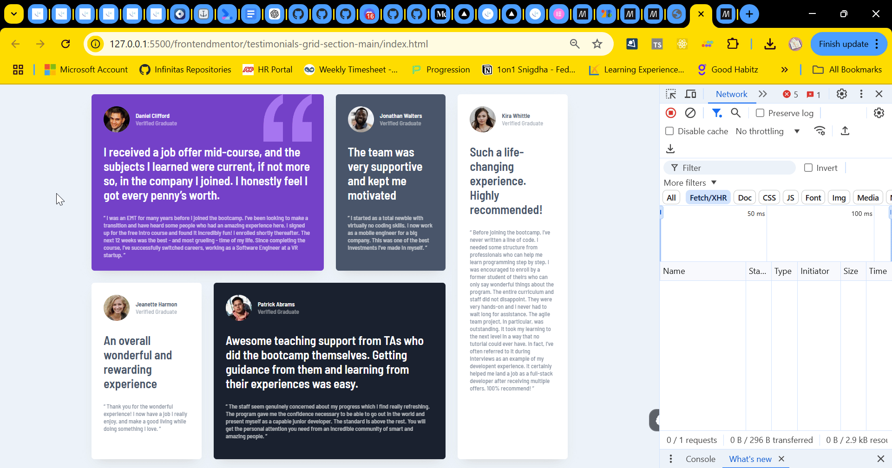

# Frontend Mentor - Testimonials grid section solution

This is a solution to the [Testimonials grid section challenge on Frontend Mentor](https://www.frontendmentor.io/challenges/testimonials-grid-section-Nnw6J7Un7).

## Table of contents

- [Overview](#overview)
  - [The challenge](#the-challenge)
  - [Screenshot](#screenshot)
  - [Links](#links)
- [My process](#my-process)
  - [Built with](#built-with)
  - [What I learned](#what-i-learned)
  - [Continued development](#continued-development)
  - [Useful resources](#useful-resources)
- [Author](#author)
- [Acknowledgments](#acknowledgments)

**Note: Delete this note and update the table of contents based on what sections you keep.**

## Overview

### The challenge

Users should be able to:

- View the optimal layout for the site depending on their device's screen size

### Screenshot



### Links

- Solution URL: [Github link](https://github.com/snigdha-sukun/testimonials-grid-section)
- Live Site URL: [Testimonials grid section](https://testimonials-grid-section-mu-two.vercel.app/)

## My process

### Built with

- Semantic HTML5 markup
- CSS custom properties
- Flexbox
- CSS Grid
- Mobile-first workflow

### What I learned

I learned how to use `background-image`:

```css
.testimonial:nth-child(1) {
    background-image: url("./images/bg-pattern-quotation.svg");
    background-position: top 0px right 2em;
    background-repeat: no-repeat;
}
```

### Continued development

I still need to practice the positioning an element & `@media`. I need to practice CSS Grid & Flexbox to create desired layout. I also need to learn about responsive CSS in general & HTML5 rules.

### Useful resources

- [Grid by Example](https://gridbyexample.com/) - This helped me in learning CSS Grid.
- [Grid Garden](https://codepip.com/games/grid-garden/) - This was a fun game to practice grid fundamentals.

## Author

- Frontend Mentor - [@snigdha-sukun](https://www.frontendmentor.io/profile/snigdha-sukun)

## Acknowledgments

I got the idea of using flexbox for mobile view & grid for desktop view from this [user](https://github.com/newspaceracer).
